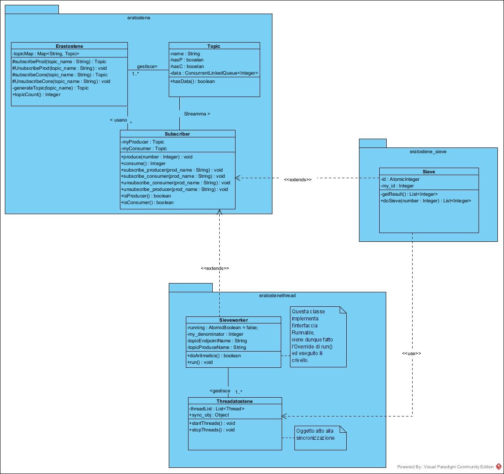
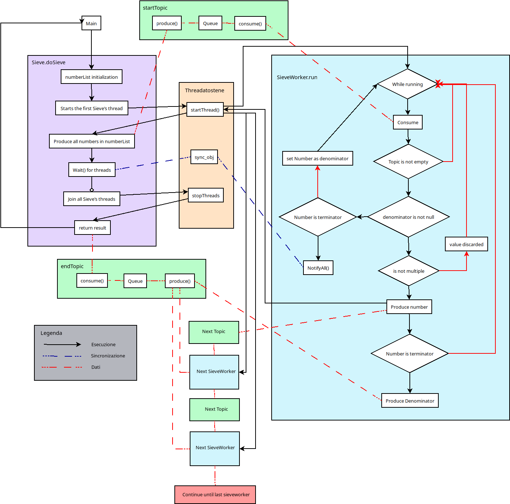

# PCAD_Eratostene
Programma sviluppato per il corso di Programmazione Concorrente ed Algoritmi Distribuiti dell'Universita' degli Studi di Genova

Gruppo (a.k.a. thread_ement):
- Andrea Valenzano 4548315
- Lorenzo Contino 4832500
- Eugenio Pallestrini 4878184

## Progetto
Il progetto si compone principalmente di due parti:
 - Gesione delle FIFO (eratostene)
 - Gestione dei threads (eratostenethread)

## Scelte ingegneristiche

Per l'implementazione della richiesta abbiamo effettuato le seguenti scelte:
 - Per la comunicazione tramite FIFO ci siamo ispirati ad un modello producer/consumer molto simile a quello fornito da *apache/kafka*.
 Abbiamo infatti implementato il concetto di Subscriber e inserito un broker per la gesione delle comunicazioni. I subscribers (nel nostro caso i processi) dovranno fare quindi richiesta al broker per avere acesso ad un canale di comunicazione (Topic). In questo modo incapsuliamo produttore e consumatore sul singolo topic eliminando il problema della concorrenza (il broker fara' sempre in modo che ci siano solo un lettore e uno scrittore per ogni FIFO).

 - In seguito alle scelte del punto prima abbiamo spostato i buffer dei singoli threads direttamente nel topic associato (a differenza del lucido di presentazione dove viene raffigurato all'interno del thread stesso).


## Architettura


- **eratostene**: pakage che implementa e gestisce le FIFO.
Implementa il Broker di comunicazione tra i threads e le FIFO stesse. Fornisce inoltre gli strumenti per interfacciarsi con il broker (Subscriber class).

- **eratostenethread**: pakage che implementa e gestisce i threads del crivello.

- **eratostene_sieve**: pakage in cui e' implementata la classe la facciata dell'intero progetto.

## Flusso di esecuzione
Riportiamo in seguito il diagramma di esecuzione del programma:


## Esempio di Output

Forniamo in seguito l'output del programma risultato dall'esecuzione del main di prova presente nel progetto.

```
=== Sieve ===================================================
Max Number = 20
 - Primes list: [2, 3, 5, 7, 11, 13, 17, 19]
 - Primes count: 8
=============================================================
Max Number = 100
 - Primes list: [2, 3, 5, 7, 11, 13, 17, 19, 23, 29, 31, 37,  
 41, 43, 47, 53, 59, 61, 67, 71, 73, 79, 83, 89, 97]
 - Primes count: 25
=============================================================
Max Number = 500
 - Primes list: [2, 3, 5, 7, 11, 13, 17, 19, 23, 29, 31, 37, 
 41, 43, 47, 53, 59, 61, 67, 71, 73, 79, 83, 89, 97, 101, 103, 
 107, 109, 113, 127, 131, 137, 139, 149, 151, 157, 163, 167, 
 173, 179, 181, 191, 193, 197, 199, 211, 223, 227, 229, 233, 
 239, 241, 251, 257, 263, 269, 271, 277, 281, 283, 293, 307, 
 311, 313, 317, 331, 337, 347, 349, 353, 359, 367, 373, 379, 
 383, 389, 397, 401, 409, 419, 421, 431, 433, 439, 443, 449, 
 457, 461, 463, 467, 479, 487, 491, 499]
 - Primes count: 95
=============================================================
Max Number = 1000
 - Primes list: <List is too long>
 - Primes count: 168
=============================================================
Max Number = 10000
 - Primes list: <List is too long>
 - Primes count: 1229
=============================================================

```


